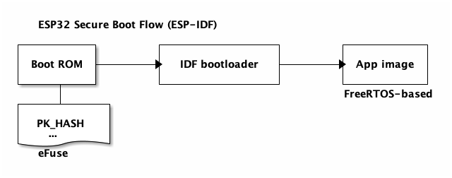
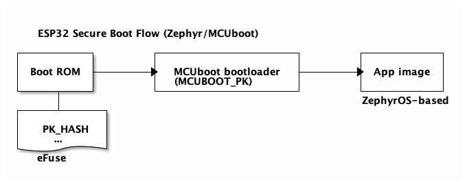

# ESP32 Development Environment in Docker Containers

Unified build environments for local development and in CI/CD, for ESP32*
boards.

<details>
<summary>ESP32: Container Local Build Setup</summary>

## ESP32

Dev board: ESP32-DevKitC-32E ([Mouser
link](https://www.mouser.com/ProductDetail/356-ESP32-DEVKITC32E);
[Datasheet](https://docs.espressif.com/projects/esp-idf/en/latest/esp32/hw-reference/esp32/get-started-devkitc.html))

Two secure boot flows are supported for this chipset.

### Secure Boot Flow: ESP-IDF

Both the IDF bootloader image and the application image are verified against
`PK_HASH` (public key hash) in eFuse.



### Secure Boot Flow: Zephyr/MCUboot

The IDF bootloader image is verified against `PK_HASH` (public key hash) in
eFuse. The application image is verified against `MCUBOOT_PK` (MCUboot public
key) in MCUboot image.



### Secure Boot Efuse Blowing

- Build container image for secure boot fuse blowing

  ```bash
  cd esp32/
  docker build -f Dockerfile.esp32_fuseblower -t esp32fb:dev \
    --build-arg IDF_SDKCONFIG=sdkconfig.sbv2_nojtag \
    --build-arg SBV2_PRIVATE_KEY=sbv2_private_dev.pem \
    .
  ```

- Run container

  ```bash
  # On Linux, add --device=/dev/ttyUSB0 (modify the device node as needed) for
  # direct board interactions from inside the container
  docker run --rm -it esp32fb:dev
  ```

Inside the container, the `void_app` application is under `~/apps`. The images
are signed using the development signing key
[sbv2_private_dev.pem](./esp32/keys/sbv2_private_dev.pem). The `void_app` can be
flashed (cf. [flashing instructions](./esp32/apps/void_app/README.md)) on an
unfused board to blow fuses to enable secure boot. Efuse values can be read out
from the board using the `espefuse.py` tool ([example
output](./esp32/data/espefuse_summary_dev_sbv2_nojtag_output.txt)).

### ESP-IDF Development

Use the fuseblower Docker image `esp32fb:dev` built with
`Dockerfile.esp32_fuseblower` above for ESP-IDF development.

- Run container (on Linux)

  ```bash
  # Suppose /dev/ttyUSB0 is the UART port of the board
  docker run --device=/dev/ttyUSB0 --rm -it esp32fb:dev
  ```

- Build sample app inside container

  ```bash
  $ pwd
  /home/esp
  # Set up environment
  . esp-idf/export.sh
  # Get sample app - hello_world and build for esp32 target
  $ cp -r esp-idf/examples/get-started/hello_world/ .
  $ cd hello_world
  $ idf.py set-target esp32
  $ idf.py build
  ```

  Inside container, you can also interact with the device using esp-idf tools, e.g.,

  ```bash
  # Display serial output
  idf.py monitor
  # Flash app and partition table images
  idf.py flash
  ```

### Zephyr/MCUboot Development (with Secure Boot Image Signing)

- Build container image for Zephyr/MCUboot development. Note that for
  `--build-arg` values, private keys must be under the
  [esp32/keys](./esp32/keys/) folder, and bootloader configs must be under
  the [esp32/configs](./esp32/configs/) folder. If no build argument is
  provided explicitly, the default values are as in the command below.

  ```bash
  cd esp32/
  docker build -f Dockerfile.esp32_mcuboot_zephyr -t esp32zephyr:dev \
    --build-arg SBV2_PRIVATE_KEY="sbv2_private_dev.pem" \
    --build-arg MCUBOOT_PRIVATE_KEY="mcuboot-ecdsa-p256_private_dev.pem" \
    --build-arg BOOTLOADER_CONFIG="bootloader_mcuboot_dev.conf" \
    .
  ```

- Run container

  ```bash
  # On Linux, add --device=/dev/ttyUSB0 (modify the device node as needed) for
  # direct board interactions from inside the container
  docker run --rm -it esp32zephyr:dev
  ```

  Inside the container,

  - For MCUboot and secure boot development
    - Use `/home/esp/mcuboot`.
    - Remember to set up the ESP-IDF environment by sourcing `export.sh`

      ```bash
      cd ${HOME}/mcuboot/boot/espressif
      source ./hal/esp-idf/export.sh
      ```

  - For Zephyr development
    - Use `/home/esp/zephyrproject`
    - Remember to activate the Python3 virtual environment

      ```bash
      source ${HOME}/zephyrproject/.venv/bin/activate
      ```

- Flash MCUboot and Zephyr App Images

  On Linux host, we can interact with the development board from the container

  ```bash
  # Suppose /dev/ttyUSB0 is the device's usb port on host
  docker run --rm -it --device=/dev/ttyUSB0 esp32zephyr:dev
  ```

  Inside container

  ```bash
  cd ${HOME}/mcuboot/boot/espressif
  source ./hal/esp-idf/export.sh
  # Flash MCUboot image at offset 0x1000
  esptool.py -p /dev/ttyUSB0 \
    -b 460800 \
    --before default_reset \
    --after no_reset \
    --chip esp32 \
    write_flash \
    --flash_mode dio \
    --flash_size keep \
    --flash_freq 40m \
    0x1000 build/mcuboot_esp32_signed.bin
  # Flash Zephyr application image at offset 0x10000. This is the slot0 offset
  # configured in bootloader.conf of MCUboot
  esptool.py -p /dev/ttyUSB0 \
    -b 460800 \
    --before default_reset \
    --after hard_reset \
    --chip esp32 \
    write_flash \
    --flash_mode dio \
    --flash_size keep \
    --flash_freq 40m \
    0x10000 ~/zephyrproject/zephyr/build/zephyr/zephyr_signed.bin
  # Monitor console output, using the void_app. This is a hack, but works well
  cd ~/apps/void_app
  idf.py -p /dev/ttyUSB0 monitor
  ```

  If the board is flashed successfully, you should see something like this

  ```text
  --- idf_monitor on /dev/ttyUSB0 115200 ---
  --- Quit: Ctrl+] | Menu: Ctrl+T | Help: Ctrl+T followed by Ctrl+H ---
  ets Jul 29 2019 12:21:46

  rst:0x1 (POWERON_RESET),boot:0x13 (SPI_FAST_FLASH_BOOT)
  configsip: 0, SPIWP:0xee
  clk_drv:0x00,q_drv:0x00,d_drv:0x00,cs0_drv:0x00,hd_drv:0x00,wp_drv:0x00
  mode:2, clock div:2
  secure boot v2 enabled
  secure boot verification succeeded
  load:0x3fff8598 len:0x1568
  load:0x40093000 len:0x48d4
  load:0x4009b800 len:0x1a00
  entry 0x40093440
  [esp32] [INF] [boot] chip revision: 3
  [esp32] [INF] Enabling RNG early entropy source...
  [esp32] [INF] *** Booting MCUboot build v1.9.0-190-gb56a65f ***
  [esp32] [INF] Primary image: magic=good, swap_type=0x1, copy_done=0x3, image_ok=0x3
  [esp32] [INF] Scratch: magic=unset, swap_type=0x1, copy_done=0x3, image_ok=0x3
  [esp32] [INF] Boot source: primary slot
  [esp32] [INF] Swap type: none
  [esp32] [INF] Disabling RNG early entropy source...
  [esp32] [INF] br_image_off = 0x10000
  [esp32] [INF] ih_hdr_size = 0x20
  [esp32] [INF] Loading image 0 - slot 0 from flash, area id: 1
  [esp32] [INF] DRAM segment: start=0xe7c, size=0x328, vaddr=0x3ffb0000
  [esp32] [INF] IRAM segment: start=0x11a4, size=0x2c70, vaddr=0x40080000
  0x40080000: _WindowOverflow4 at /home/esp/mcuboot/boot/espressif/hal/esp-idf/components/freertos/port/xtensa/xtensa_vectors.S:1736

  [esp32] [INF] start=0x40082a88
  0x40082a88: _gettimeofday_r at /home/esp/mcuboot/boot/espressif/hal/esp-idf/components/newlib/time.c:179

  *** Booting Zephyr OS build e26bf578c674 ***
  Hello World! esp32
  ```
</details>

<details>
<summary>ESP32-S2: Container Local Build Setup</summary>

## ESP32-S2 (MCUboot and Zephyr)

Dev board: ESP32-S2-DevKitM-1-N4R2 ([Mouser
link](https://www.mouser.com/ProductDetail/Espressif-Systems/ESP32-S2-DevKitM-1-N4R2?qs=vvQtp7zwQdNx66oTi6gqpw%3D%3D&countryCode=US&currencyCode=USD);
[Datasheet](https://www.mouser.com/new/espressif/espressif-esp32-s2-kits/))


### Secure Boot Flow: Zephyr/MCUboot

The IDF bootloader image is verified against `PK_HASH` (public key hash) in
eFuse. The application image is verified against `MCUBOOT_PK` (MCUboot public
key) in MCUboot image.


### Secure Boot Efuse Blowing

- Build container image for secure boot fuse blowing

  ```bash
  cd esp32s2/
  docker build -f Dockerfile.esp32s2_fuseblower -t esp32s2fb:latest \
    --build-arg IDF_SDKCONFIG=sdkconfig.sbv2_nojtag \
    --build-arg SBV2_PRIVATE_KEY=sbv2_private_dev.pem \
    .
  ```

- Run container

  ```bash
  docker run --rm -it esp32s2fb:latest
  ```

Inside the container, the two applications, `void_app` and `efuse_app` are under
`~/apps`. They are signed using the development signing key
[sbv2_private_dev.pem](./esp32s2/keys/sbv2_private_dev.pem). The `void_app` can
be flashed (cf. [flashing instructions](./esp32s2/apps/void_app/README.md)) on
an unfused board to blow fuses to enable secure boot. The `efuse_app` can be
flashed (cf. [flashing instructions](./esp32s2/apps/efuse_app/README.md)) on a
development-fused board to read out efuse values.

### Zephyr/MCUboot Development (with Secure Boot Image Signing)

- Build container image for Zephyr/MCUboot development. Note that for
  `--build-arg` values, private keys must be under the
  [esp32s2/keys](./esp32s2/keys/) folder, and bootloader configs must be under
  the [esp32s2/configs](./esp32s2/configs/) folder. If no build argument is
  provided explicitly, the default values are as in the command below.

  ```bash
  cd esp32s2/
  docker build -f Dockerfile.esp32s2_zephyr -t esp32s2zephyr:latest \
    --build-arg SBV2_PRIVATE_KEY="sbv2_private_dev.pem" \
    --build-arg MCUBOOT_PRIVATE_KEY="mcuboot-ecdsa-p256_private_dev.pem" \
    --build-arg BOOTLOADER_CONFIG="bootloader_mcuboot_dev.conf" \
    .
  ```

- Run container

  ```bash
  docker run --rm -it esp32s2zephyr:latest
  ```

  Inside the container,

  - For MCUboot and secure boot development
    - Use `/home/esp/mcuboot`.
    - Remember to set up the ESP-IDF environment by sourcing `export.sh`

      ```bash
      cd ${HOME}/mcuboot/boot/espressif
      source ./hal/esp-idf/export.sh
      ```

  - For Zephyr development
    - Use `/home/esp/zephyrproject`
    - Remember to activate the Python3 virtual environment

      ```bash
      source ${HOME}/zephyrproject/.venv/bin/activate
      ```

- Flash MCUboot and Zephyr App Images

  On Linux host, we can interact with the development board from the container

  ```bash
  # Suppose /dev/ttyUSB0 is the device's usb port on host
  docker run --rm -it --device=/dev/ttyUSB0 esp32s2zephyr:latest
  ```

  Inside container

  ```bash
  cd ${HOME}/mcuboot/boot/espressif
  source ./hal/esp-idf/export.sh
  # Flash MCUboot image at offset 0x1000
  esptool.py -p /dev/ttyUSB0 \
    -b 460800 \
    --before default_reset \
    --after no_reset \
    --chip esp32s2 \
    write_flash \
    --flash_mode dio \
    --flash_size keep \
    --flash_freq 40m \
    0x1000 build/mcuboot_esp32s2_signed.bin
  # Flash Zephyr application image at offset 0x10000. This is the slot0 offset
  # configured in bootloader.conf of MCUboot
  esptool.py -p /dev/ttyUSB0 \
    -b 460800 \
    --before default_reset \
    --after hard_reset \
    --chip esp32s2 \
    write_flash \
    --flash_mode dio \
    --flash_size keep \
    --flash_freq 40m \
    0x10000 ~/zephyrproject/zephyr/build/zephyr/zephyr_signed.bin
  # Monitor console output, using the void_app. This is a hack, but works well
  cd ~/apps/void_app
  idf.py -p /dev/ttyUSB0 monitor
  ```

  If the board is flashed successfully, you should see something like this

  ```text
  --- idf_monitor on /dev/ttyUSB0 115200 ---
  --- Quit: Ctrl+] | Menu: Ctrl+T | Help: Ctrl+T followed by Ctrl+H ---
  ESP-ROM:esp32s2-rc4-20191025
  Build:Oct 25 2019
  rst:0x1 (POWERON),boot:0x8 (SPI_FAST_FLASH_BOOT)
  SPIWP:0xee
  mode:DIO, clock div:2
  Valid secure boot key blocks: 0
  secure boot verification succeeded
  load:0x3ffe8598,len:0x1368
  load:0x40048000,len:0x3cc4
  load:0x40050000,len:0x169c
  entry 0x40048354
  [esp32s2] [INF] [boot] chip revision: 0
  [esp32s2] [INF] Enabling RNG early entropy source...
  [esp32s2] [INF] *** Booting MCUboot build v1.9.0-190-gb56a65f ***
  [esp32s2] [INF] Primary image: magic=good, swap_type=0x1, copy_done=0x3, image_ok=0x3
  [esp32s2] [INF] Scratch: magic=unset, swap_type=0x1, copy_done=0x3, image_ok=0x3
  [esp32s2] [INF] Boot source: primary slot
  [esp32s2] [INF] Swap type: none
  [esp32s2] [INF] Disabling RNG early entropy source...
  [esp32s2] [INF] br_image_off = 0x10000
  [esp32s2] [INF] ih_hdr_size = 0x20
  [esp32s2] [INF] Loading image 0 - slot 0 from flash, area id: 1
  [esp32s2] [INF] DRAM segment: start=0x374c, size=0x2c0, vaddr=0x3ffb6fe0
  [esp32s2] [INF] IRAM segment: start=0xdc0, size=0x298c, vaddr=0x40022000
  0x40022000: _WindowOverflow4 at /home/esp/esp-idf/components/freertos/FreeRTOS-Kernel/portable/xtensa/xtensa_vectors.S:1751

  [esp32s2] [INF] start=0x4002477c
  0x4002477c: __retarget_lock_close_recursive at /home/esp/esp-idf/components/newlib/locks.c:294

  *** Booting Zephyr OS build 1751c8f0f59d ***
  Hello World! esp32s2_saola
  ```

</details>

<details>
<summary>ESP32-S3: Container Local Build Setup</summary>

## ESP32-S3

Dev board: ESP32-S3-DevKitC-1-N8R8 ([Mouser
link](https://www.mouser.com/ProductDetail/Espressif-Systems/ESP32-S3-DevKitC-1-N8R8?qs=7D1LtPJG0i2PiuUUKucutQ%3D%3D&countryCode=US&currencyCode=USD);
[Datasheet](https://docs.espressif.com/projects/esp-idf/en/latest/esp32s3/hw-reference/esp32s3/user-guide-devkitc-1.html))

### Secure Boot Flow: ESP-IDF

Both the IDF bootloader image and the application image are verified against
`PK_HASH` (public key hash) in eFuse.


### Build and Run Container Image for ESP-IDF Development

- Build container image

  ```bash
  cd esp32s3/
  # SBV2_PRIVATE_KEY is the name of the private key in keys/
  # IDF_SDKCONFIG is the name of the sdkconfig file in configs/
  docker build -f Dockerfile.esp32s3_fuseblower -t esp32s3:latest \
    --build-arg SBV2_PRIVATE_KEY="sbv2_private_dev.pem" \
    --build-arg IDF_SDKCONFIG="sdkconfig.dev-sbv2_nojtag" \
    .
  ```

- Run container

  ```bash
  docker run --rm -it esp32s3:latest
  ```

- Build sample app inside container

  ```bash
  $ pwd
  /home/esp
  # Set up environment
  . esp-idf/export.sh
  # Get sample app - hello_world and build for esp32s3 target
  $ cp -r esp-idf/examples/get-started/hello_world/ .
  $ cd hello_world
  $ idf.py set-target esp32s3
  $ idf.py build
  ```

- On-target testing from Docker container (for Linux)

  If you are on Linux, you can develop and test your ESP32-S3 dev board entirely
  in the Docker container.

  ```bash
  # Suppose /dev/ttyUSB0 is the device's usb port on host
  docker run --rm -it --device=/dev/ttyUSB0 esp32s3:latest
  ```

  Inside container, you can interact with the device using esp-idf tools, e.g.,

  ```bash
  # Display serial output
  idf.py monitor
  # Flash app and partition table images
  idf.py flash
  ```
</details>

<details>
<summary>Use Pre-built Containers</summary>

## Pull Pre-built Container Images from GHCR
One can pull pre-built container images from the GitHub Container Registry
(GHCR) in [GitHub
Packages](https://github.com/orgs/thistletech/packages?repo_name=esp32-devenvs).

```bash
# Example: docker pull ghcr.io/thistletech/devenv_zephyr_base:91717a88614327e2c1bd75452d9d0118a04a6400
$ docker pull <GHCR_IMAGE_URI>
```

Packages named `devenv_idf_base` and `devenv_zephyr_base` are Docker images that
set up the build environments for ESP-IDF and MCUboot/ZephyrOS development,
respectively. They are used as base images in Dockerfiles whose names are
suffixed with `_fuseblower` or `mcuboot_zephyr` (e.g.,
[esp32/Dockerfile_esp32_fuseblower](./esp32/Dockerfile.esp32_fuseblower) and
[esp32/Dockerfile.esp32_mcuboot_zephyr](./esp32/Dockerfile.esp32_mcuboot_zephyr))
to build and development-sign bootloader and application images.

</details>